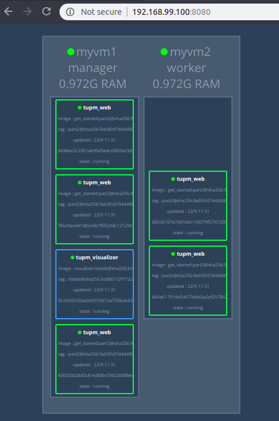
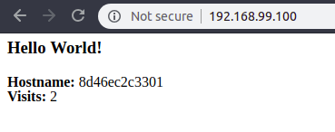
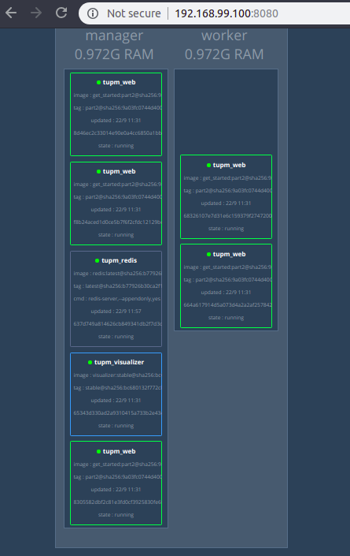

# Getting Started with Docker

## Table of Contents

*   [Orientation and Setup](#orientation-and-setup)
    *   [Docker concepts](#docker-concepts)
        *   [Images and Containers](#images-and-containers)
        *   [Containers and Virtual Machines](#containers-and-virtual-machines)
    *   [Prepare Your Docker Environment](#prepare-your-docker-environment)
    *   [Recap and Cheat Sheet](#recap-and-cheat-sheet)
*   [Containers](#containers)
    *   [Define a Container with Dockerfile](#define-a-container-with-dockerfile)
    *   [Build The App](#build-the-app)
    *   [Share Images](#share-images)
*   [Services](#services)
    *   [Docker Compose](#docker-compose)
    *   [About Services](#about-services)
    *   [Docker Compose File Example](#docker-compose-file-example)
    *   [Run The App](#run-the-app)
    *   [Scale The App](#scale-the-app)
    *   [Take down The App and The Swarm](#take-down-the-app-and-the-swarm)
*   [Swarms](#swarms)
    *   [Docker Machine](#docker-machine)
    *   [Understand Swarm Clusters](#understand-swarm-clusters)
    *   [Set up Your Swarm](#set-up-your-swarm)
        *   [Create a Cluster](#create-a-cluster)
    *   [Deploy Apps on the Swarm Cluster](#deploy-apps-on-the-swarm-cluster)
    *   [Intergrating and Scaling Your App](#intergrating-and-scaling-your-app)
    *   [Cleanup and Reboot](#cleanup-and-reboot)
*   [Stacks](#stacks)
    *   [Add New Services and Redeploy](#add-new-services-and-redeploy)
    *   [Persist Data](#persist-data)
*   [Deploy Your App](#deploy-your-app)

## Orientation and Setup

### Docker concepts

Docker là nền tảng giúp các devs và sysadmins có thể cung cấp, triển khai và vận hành các ứng dụng bên trong các containers. Khái niệm bao đóng ứng dụng trong các containers ngày càng trở nên phổ biến vì những tính chất sau:

*   Flexible
*   Lightweight
*   Interchangeable: Có thể triển khai các bản cập nhật và nâng cấp tại chỗ
*   Portable
*   Scalable
*   Stackable

#### Images and Containers

Một container được vận hành bằng cách chạy một image. Một **image** là một package thực thi được chứa toàn bộ những gì bạn cần để chạy ứng dụng: code, runtime, libraries, environment variables và configuration files.

Một **container** là một thể hiện tại runtime của image. Có thể sử dụng lệnh `docker ps` để xem các containers đang chạy.

#### Containers and Virtual Machines

Một **container** chạy như một ứng dụng thuần trên Linux, chia sẻ kernel trên máy trạm với các containers khác. Do nó chỉ chạy trên một tiến trình và không chiếm nhiều tài nguyên hơn các ứng dụng khác nên rất nhẹ.

Ngược lại, một **virtual machine** chạy toàn bộ cả một guest OS, truy cập tới tài nguyên máy trạm bằng các *virtual access* thông qua một hypervisor. Nhìn chung, một VM luôn cung cấp nhiều tài nguyên hơn là những gì ứng dụng cần.


### Prepare Your Docker Environment

read the docs.

### Recap and Cheat Sheet

*   List Docker CLI commands

        docker
        docker container --help

*   Display Docker version and info

        docker --version
        docker version
        docker info

*   Execute Docker image

        docker run hello-world

*   List Docker images

        docker image ls

*   List Docker containers (running, all, all in quiet mode)

        docker container ls
        docker container ls --all
        docker container ls -aq

## Containers

Ở phần này, ta sẽ lấy ví dụ triển khai một ứng dụng Python với Docker.

### Define a Container with Dockerfile

`Dockerfile` định nghĩa ra các thao tác diễn ra ở môi trường bên trong một container, là file được yêu cầu để tạo ra một docker image.

Dưới đây là một mẫu dockerfile giúp triển khai container cho một ứng dụng flask:

    # Use an official Python runtime as a parent image
    FROM python:2.7-slim

    # Set the working directory to /app
    WORKDIR /app

    # Copy the current directory contents into the container at /app
    ADD . /app

    # Install any needed packages specified in requirements.txt
    RUN pip install --trusted-host pypi.python.org -r requirements.txt

    # Make port 80 available to the world outside this container
    EXPOSE 80

    # Define environment variable
    ENV NAME World

    # Run app.py when the container launches
    CMD ["python", "app.py"]

Chú ý rằng, ta có hai file được tham chiếu đến trong dockerfile này, đó là:

*   `requirements.txt`: Các python package bắt buộc cần cài đặt (bằng lệnh pip)

    ```bash
    Flask
    Redis
    ```

*   `app.py`: Mã nguồn của Flask app

    ```python
    from flask import Flask
    from redis import Redis, RedisError
    import os
    import socket

    # Connect to Redis
    redis = Redis(host="redis", db=0, socket_connect_timeout=2, socket_timeout=2)

    app = Flask(__name__)

    @app.route("/")
    def hello():
        try:
            visits = redis.incr("counter")
        except RedisError:
            visits = "<i>cannot connect to Redis, counter disabled</i>"

        html = "<h3>Hello {name}!</h3>" \
               "<b>Hostname:</b> {hostname}<br/>" \
               "<b>Visits:</b> {visits}"
        return html.format(name=os.getenv("NAME", "world"), hostname=socket.gethostname(), visits=visits)

    if __name__ == "__main__":
        app.run(host='0.0.0.0', port=80)
    ```

### Build The App

*   Tại folder cha của project, ta thực hiện build image cho container bằng câu lệnh:

    ```bash
    docker build -t friendlyhello
    ```

*   Kiểm tra các image đã được tạo:

    ```bash
    root@Tubuntu:~/docker/flask-app# docker image ls
    REPOSITORY          TAG                 IMAGE ID            CREATED             SIZE
    friendlyhello       latest              93ad117a25df        9 days ago          149MB
    ```

*   Chạy app:

    ```bash
    docker run -p 4000:80 friendlyhello
    ```

### Share Images

*   Đăng nhập:

    docker login

*   Đặt tên lại cho image theo khuôn dạng `username/repository:tag`:

    docker tag tupm/get_started:part2
*   Publish image:

```bash
root@Tubuntu:~# docker push tupm/get_started:part2
The push refers to repository [docker.io/tupm/get_started]
23b8c3dafbb6: Pushed 
fe93fb85e73d: Pushed 
aae3c8c63bca: Pushed 
7dea3d4f198f: Mounted from library/python 
f40e2f1ad985: Mounted from library/python 
0df9994a4d58: Mounted from library/python 
8c3e1412c5e0: Mounted from library/python 
8b15606a9e3e: Mounted from library/python 
part2: digest: sha256:9a03fc0744d400893fbde18c46ac1d6a4476567a170b71a7bc210e5e3769b271 size: 1995

```

*   Từ một máy khác, pull image này về và chạy:

    docker pull tupm/get_started:part2
    docker tag tupm/get_started:part2 new_image
    docker run -p 4000:80 new_image

## Services

### Docker Compose

`Docker Compose` là một công cụ giúp định nghĩa và chạy các ứng dụng Docker chạy trên nhiều containers thông qua các file cấu hình YAML. Thao tác sử dụng Compose thông qua ba bước:

1.  Định nghĩa `Dockerfile`
1.  Định nghĩa các services của app trong file `docker-compose.yml` để nó có thể chạy trong môi trường cô lập
1.  Thực thi lệnh `docker-compose up` và khởi động app thông qua Compose

Các tính năng của Compose:

*   Nhiều môi trường cô lập trên một host: Compose cô lập môi trường thông qua project name
*   Lưu giữ volume data khi containers được khởi tạo: Compose tìm lại các volumes tương ứng của một containers ở lần khởi tạo trước đó và gán nó cho lần khởi tạo mới, đảm bảo dữ liệu cũ không bị mất đi
*   Chỉ tạo containers khi cần thiết: Compose tái sử dụng containers cũ khi chúng được khởi tạo lại
*   Lưu trữ biến trong Compose files và tái sử dụng cho nhiều môi trường

Các ca sử dụng phổ biến:

*   Triển khai môi trường
*   Tự động hóa kiểm thử môi trường
*   Triển khai trên Docker engine từ xa
*   ...

Cài đặt Compose

    sudo curl -L "https://github.com/docker/compose/releases/download/1.22.0/docker-compose-$(uname -s)-$(uname -m)" -o /usr/local/bin/docker-compose

    sudo chmod +x /usr/local/bin/docker-compose

### About Services

Trong các ứng dụng phân tán, các thành phần của một ứng dụng được gọi là các "services". Các services đơn giản chỉ là các "containers in productions". Mỗi service chỉ chạy trên một image và nó có thể lập trình cách thức image đó được chạy: sử dụng port nào, số container sao lưu cần thiết, etc. Mở rộng quy mô của một service làm tăng cường số containers cần thiết để vận hành phần mềm, yêu cầu thêm nhiều tài nguyên tính toán cho service.

Để quản lý thao tác định nghĩa, chạy và mở rộng các services trên Docker, ta sử dụng Compose với file `docker-compose.yml`

### Docker Compose File Example

Dưới đây là một file `docker-compose.yml`:

    version: "3"
    services:
      web:
        image: tupm/get_started:part2
        deploy:
          replicas: 5
          resources:
            limits:
              cpus: "0.1"
              memory: 50M
          restart_policy:
            condition: on-failure
        ports:
          - "4000:80"
        networks:
          - webnet
    networks:
      webnet:

File này làm những công việc sau:

*   Pull một image đã được tạo ra trước đó
*   Định nghĩa ra một service tên `web` chạy image này
    *   Có 5 bản sao được tạo ra
    *   Mỗi bản sao dùng tối đa 10% CPU trên host và 50MB RAM
    *   Yêu cầu restart containers khi có lỗi xảy ra
    *   Chạy service trên cổng 80 trên các containers và map với cổng 4000 trên host
    *   Sử dụng mạng webnet
*   Định nghĩa mạng webnet với các thông số mặc định (load-balanced overlay network)

### Run The App

*   Trước khi triển khai cần khởi tạo 'swarm' (sẽ được giới thiệu sau):

    ```bash
    root@Tubuntu:~/docker# docker swarm init --advertise-addr 192.168.1.10
    Swarm initialized: current node (0erk8dxn8gjrmzdc7qm3h9noh) is now a manager.

    To add a worker to this swarm, run the following command:

        docker swarm join --token SWMTKN-1-1laef7k3io3i90hqee4pt7km6ilvuphep9xn389yj7cx7m5pvx-6s8wnbaydop5unpy8ausozl3n 192.168.1.10:2377

    To add a manager to this swarm, run 'docker swarm join-token manager' and follow the instructions.

    ```

*   Triển khai app

    ```bash
    root@Tubuntu:~/docker# docker stack deploy -c docker-compose.yml tupm
    Creating network tupm_webnet
    Creating service tupm_web
    ```

*   Xem danh sách các services đã tạo:

```bash
root@Tubuntu:~/docker# docker service ls
ID                  NAME                MODE                REPLICAS            IMAGE                    PORTS
oswnn8ad2a02        tupm_web            replicated          0/5                 tupm/get_started:part2   *:4000->80/tcp
```
*   Service chạy trên một container gọi là `task`, liệt kê tasks bằng câu lệnh:

```bash
root@Tubuntu:~/docker# docker service ps tupm_web
ID                  NAME                IMAGE                    NODE                DESIRED STATE       CURRENT STATE            ERROR               PORTS
w1xx8tu5rghu        tupm_web.1          tupm/get_started:part2   Tubuntu             Running             Running 13 seconds ago                       
nklrgfcqo88c        tupm_web.2          tupm/get_started:part2   Tubuntu             Running             Running 17 seconds ago                       
rt4quabcvbwa        tupm_web.3          tupm/get_started:part2   Tubuntu             Running             Running 12 seconds ago                       
m8ube1jqbl4p        tupm_web.4          tupm/get_started:part2   Tubuntu             Running             Running 13 seconds ago                       
se0e04lx6lk9        tupm_web.5          tupm/get_started:part2   Tubuntu             Running             Running 17 seconds ago           
```
*   Các containers tương ứng với các tasks:

    ```bash
    root@Tubuntu:~/docker# docker container ls 
    CONTAINER ID        IMAGE                    COMMAND             CREATED              STATUS              PORTS               NAMES
    759f855d74b4        tupm/get_started:part2   "python app.py"     About a minute ago   Up 54 seconds       80/tcp              tupm_web.3.rt4quabcvbwavjrsnkyvj24dx
    cd74eb3f7a7a        tupm/get_started:part2   "python app.py"     About a minute ago   Up 55 seconds       80/tcp              tupm_web.1.w1xx8tu5rghun400uicb0c3xo
    9e15d15f8ba1        tupm/get_started:part2   "python app.py"     About a minute ago   Up About a minute   80/tcp              tupm_web.2.nklrgfcqo88cs4oy8u79aod3e
    3ff074716d82        tupm/get_started:part2   "python app.py"     About a minute ago   Up 59 seconds       80/tcp              tupm_web.5.se0e04lx6lk9dy7x8yq3o7npe
    ac95fc5890d6        tupm/get_started:part2   "python app.py"     About a minute ago   Up 54 seconds       80/tcp              tupm_web.4.m8ube1jqbl4pw9tlj4hhm0wqr

    ```

*   Truy cập vào trang "http://localhost:4000"

```bash
root@Tubuntu:~/docker# curl http://localhost:4000
<h3>Hello World!</h3><b>Hostname:</b> 759f855d74b4<br/><b>Visits:</b> <i>cannot connect to Redis, counter disabled</i>
```

### Scale The App

Ta có thể mở rộng app rất dễ dàng, ví dụ như tăng số lượng bản sao trong file `docker-compose.yml`:

    replicas: 7

Sau đó khởi động lại app:

    ```bash
    root@Tubuntu:~/docker# docker stack deploy -c docker-compose.yml tupm
    Updating service tupm_web (id: oswnn8ad2a0220wld8c6hqd38)
    root@Tubuntu:~/docker# docker service ps tupm_web
    ID                  NAME                IMAGE                    NODE                DESIRED STATE       CURRENT STATE            ERROR               PORTS
    w1xx8tu5rghu        tupm_web.1          tupm/get_started:part2   Tubuntu             Running             Running 6 minutes ago                        
    nklrgfcqo88c        tupm_web.2          tupm/get_started:part2   Tubuntu             Running             Running 7 minutes ago                        
    rt4quabcvbwa        tupm_web.3          tupm/get_started:part2   Tubuntu             Running             Running 6 minutes ago                        
    m8ube1jqbl4p        tupm_web.4          tupm/get_started:part2   Tubuntu             Running             Running 6 minutes ago                        
    se0e04lx6lk9        tupm_web.5          tupm/get_started:part2   Tubuntu             Running             Running 7 minutes ago                        
    b5kjtdculg4s        tupm_web.6          tupm/get_started:part2   Tubuntu             Running             Starting 3 seconds ago                       
    kw2yk3e6yezp        tupm_web.7          tupm/get_started:part2   Tubuntu             Running             Starting 3 seconds ago                       
    root@Tubuntu:~/docker# 

    ```

### Take down The App and The Swarm

*   Hủy app đang chạy:

    docker stack rm tupm

*   Hủy swarm

    docker swarm leave --force

## Swarms

### Docker Machine

Docker Machine là một công cụ giúp ta cài đặt Docker engine trên các máy ảo và quản lý chúng với câu lệnh `docker-machine`. Sử dụng `docker-machine`, ta có thể khởi động, kiểm tra, dừng và khởi động lại host, nâng cấp Docker client và daemon, cấu hình Docker client giao tiếp với host.

Ca sử dụng chính cho Docker Machine đó là làm việc với các Docker hosts trên các hệ thống từ xa.

Cài đặt Docker Machine:

```bash
$ base=https://github.com/docker/machine/releases/download/v0.14.0 &&
  curl -L $base/docker-machine-$(uname -s)-$(uname -m) >/tmp/docker-machine &&
  sudo install /tmp/docker-machine /usr/local/bin/docker-machine
```

### Understand Swarm Clusters

Một swarm là một nhóm các máy cùng chạy Docker và cùng tham gia vào một cụm. Sau khi tham gia cụm, câu lệnh Docker được thực thi trên cụm bởi một **swarm manager**. Các máy trên swarm có thể là máy thực hoặc máy ảo, được gọi là các **nodes**.

Swarm manager có thể sử dụng nhiều chiến lược để chạy các container, ví dụ như "emptiest node" - chạy container trên node hoạt động ít nhất, hay "global" - mỗi node có một phiên bản của container. Ta chỉ ra các chiến lược này trong Compose file giống như đã làm ở phần trước.

Swarm **managers** là các nodes duy nhất trong swarm có thể thực thi các câu lệnh, hoặc cho phép các máy khác gia nhập vào swarm như là các **workers**. Workers chỉ đóng vai trò cung cấp dung lượng cho cụm chứ không có tác dụng yêu cầu các node khác làm hay không làm gì.

Khi chuyển hoạt động của Docker từ single-host mode sang swarm mode, Docker sẽ chạy các command trên swarm, thay vì trên máy hiện tại.

### Set up Your Swarm

*   Khởi tạo swarm:

    docker swarm init

*   hoặc join vào một swarm khác:

    docker swarm join

#### Create a Cluster

*   Tạo 2 VMs với `docker-machine`:

    docker-machine create --driver virtualbox myvm1
    docker-machine create --driver virtualbox myvm2

*   Xem danh sách và địa chỉ IP của các VMs đã tạo:

    ```bash
    root@Tubuntu:~# docker-machine ls
    NAME    ACTIVE   DRIVER       STATE     URL                         SWARM   DOCKER        ERRORS
    myvm1   -        virtualbox   Running   tcp://192.168.99.100:2376           v18.06.1-ce   
    myvm2   -        virtualbox   Running   tcp://192.168.99.101:2376           v18.06.1-ce   

    ```
*   Khởi tạo node `myvm1` là swarm manager:

    ```bash
    root@Tubuntu:~# docker-machine ssh myvm1 "docker swarm init --advertise-addr 192.168.99.100"
    Swarm initialized: current node (2wjprcocqah1icu47pbj9q3bt) is now a manager.

    To add a worker to this swarm, run the following command:

        docker swarm join --token SWMTKN-1-4jodpbe2e0avqvf3mnyj23057ja0nbmycujqv1xp7sh705jick-e8173guvrwj5omqz5lxvrcsvk 192.168.99.100:2377

    To add a manager to this swarm, run 'docker swarm join-token manager' and follow the instructions.

    ```

*   Giờ ta muốn join myvm2 vào swarm như một worker, trước hết, lấy token bằng cách:

    ```bash
    root@Tubuntu:~# docker-machine ssh myvm1 "docker swarm join-token worker"
    To add a worker to this swarm, run the following command:

        docker swarm join --token SWMTKN-1-4jodpbe2e0avqvf3mnyj23057ja0nbmycujqv1xp7sh705jick-e8173guvrwj5omqz5lxvrcsvk 192.168.99.100:2377
    ```

*   SSH kết quả trả về cho myvm2 là ok

    ```bash
    root@Tubuntu:~# docker-machine ssh myvm2 " docker swarm join --token SWMTKN-1-4jodpbe2e0avqvf3mnyj23057ja0nbmycujqv1xp7sh705jick-e8173guvrwj5omqz5lxvrcsvk 192.168.99.100:2377"
    This node joined a swarm as a worker.
    ```

### Deploy Apps on the Swarm Cluster

*   Cấu hình `docker-machine` shell cho swarm manager:

    eval $(docker-machine env myvm1)

*   Như vậy, shell mà ta đang làm việc bây giờ thao tác trực tiếp với myvm1 thay vì thao tác với host, tuy nhiên nó vẫn có thể truy cập các files trên host một cách bình thường

*   Triển khai app với file `docker-compose.yml` đã tạo:

    ```bash
    root@Tubuntu:~/docker# docker stack deploy -c docker-compose.yml tupm
    Creating network tupm_webnet
    Creating service tupm_web
    ```

*   Kiểm tra:

    ```bash
    root@Tubuntu:~/docker# docker stack ps tupm
    ID                  NAME                IMAGE                    NODE                DESIRED STATE       CURRENT STATE              ERROR               PORTS
    lfx46d19uqxd        tupm_web.1          tupm/get_started:part2   myvm2               Running             Preparing 35 seconds ago                       
    vhjfy90q6bfr        tupm_web.2          tupm/get_started:part2   myvm1               Running             Preparing 34 seconds ago                       
    q2ql1br5cqp4        tupm_web.3          tupm/get_started:part2   myvm2               Running             Preparing 35 seconds ago                       
    ondkx0aywm42        tupm_web.4          tupm/get_started:part2   myvm2               Running             Preparing 35 seconds ago                       
    ieeo8azsgai2        tupm_web.5          tupm/get_started:part2   myvm1               Running             Preparing 34 seconds ago                       
    l60u1ydycftc        tupm_web.6          tupm/get_started:part2   myvm2               Running             Preparing 36 seconds ago                       
    di7yhlh6a2mo        tupm_web.7          tupm/get_started:part2   myvm1               Running             Preparing 35 seconds ago   
    ```

*   Truy cập một trong hai vm để lấy về trang index:

    ```bash
    root@Tubuntu:~/docker# curl 192.168.99.100:4000
    <h3>Hello World!</h3><b>Hostname:</b> 0f40df9b520b<br/><b>Visits:</b> <i>cannot connect to Redis, counter disabled</i>
    ```
### Intergrating and Scaling Your App

*   Ta có thể mở rộng app giống như những gì đã làm trong phần "Services", chỉ cần thay đổi file `docker-compose.yml` là đủ

*   Nếu có một node nữa muốn join vào swarm, thực hiện lại câu lệnh `docker swarm join`

### Cleanup and Reboot

*   Ngừng hoạt động app:

    docker stack rm tupm

*   Hủy swarm nếu muốn:

    docker swarm leave --force (on each node)

*   Unset các biến môi trường của `docker-machine`:

    eval $(docker-machine env -u)

## Stacks

Stack là một nhóm của các dịch vụ không liên quan đến nhau nhưng chia sẻ chung các yêu cầu phụ thuộc và có thể mở rộng cùng nhau. Mỗi stack có khả năng định nghĩa và điều phối các chứng năng của toàn bộ ứng dụng (không quá phức tạp).

### Add New Services and Redeploy

*   Thêm một service với tên `visualizer` vào trong file `docker-compose.yml`:

    ```bash
    version: "3"
    services:
      web:
        # replace username/repo:tag with your name and image details
        image: username/repo:tag
        deploy:
          replicas: 5
          restart_policy:
            condition: on-failure
          resources:
            limits:
              cpus: "0.1"
              memory: 50M
        ports:
          - "80:80"
        networks:
          - webnet
      visualizer:
        image: dockersamples/visualizer:stable
        ports:
          - "8080:8080"
        volumes:
          - "/var/run/docker.sock:/var/run/docker.sock"
        deploy:
          placement:
            constraints: [node.role == manager]
        networks:
          - webnet
    networks:
      webnet:
    ```
*   *Chú ý:* 
    *   `volumes` key cấp quyền cho `visualzier` truy cập đến file host socket cho Docker
    *   `placement` key yêu cầu dịch vụ này phải được chạy trên swarm manager

*   Triển khai lại app với file docker-compose đã được thay đổi:

    docker stack deploy -c docker-compose.yml tupm

*   `visualizer` là service giúp hiển thị thông tin các service được tạo ra trên giao diện web, truy cập đến nó qua địa chỉ:

    192.168.99.100:8080



### Persist Data

Tại đây ta thêm dịch vụ Redis database cho app.

*   Thêm `redis` service trong file `docker-compose.yml`:

    ```bash
    version: "3"
    services:
      web:
        image: tupm/get_started:part2
        deploy:
          replicas: 5
          resources:
            limits:
              cpus: "0.1"
              memory: 50M
          restart_policy:
            condition: on-failure
        ports:
          - "80:80"
        networks:
          - webnet
      visualizer:
        image: dockersamples/visualizer:stable
        ports:
          - "8080:8080"
        volumes:
          - "/var/run/docker.sock:/var/run/docker.sock"
        deploy:
          placement:
            constraints: [node.role == manager]
        networks:
          - webnet
      redis:
        image: redis
        ports:
          - "6379:6379"
        volumes:
          - "/home/docker/data:/data"
        deploy:
          placement:
            constraints: [node.role == manager]
        command: redis-server --appendonly yes
        networks:
          webnet
    networks:
      - webnet:
    ```

*   *Chú ý*:
    *   Redis có một official image trên repository `redis`
    *   Cổng mặc định của redis là 6379
    *   `redis` luôn chạy trên manager
    *   Địa chỉ "/home/docker/data" và "/data" là địa chỉ mặc định lưu trữ dữ liệu Redis trên manager node và trên container. Khi container đóng lại, dữ liệu vẫn còn lưu trữ trên manager node

*   Tạo thư mục "data/" trên manager node:

    ```bash
    root@Tubuntu:~/docker# docker-machine ssh myvm1 'mkdir /home/docker/data'
    ```

*   Lấy các biến môi trường của myvm1

    eval $(docker-machine env myvm1)

*   Deploy lại app:

    ```bash
    root@Tubuntu:~/docker# docker stack deploy -c docker-compose.yml tupm
    Creating service tupm_redis
    Updating service tupm_web (id: pev7iedx5gnznp1bv1kyq5mln)
    Updating service tupm_visualizer (id: lvm0uug7dl15dzv46w46hgdro)
    ```

*   Kiểm tra quá trình cài đặt:

    ```bash
    root@Tubuntu:~/docker# docker service ls
    ID                  NAME                MODE                REPLICAS            IMAGE                             PORTS
    okg0kjtvuw66        tupm_redis          replicated          1/1                 redis:latest                      *:6379->6379/tcp
    lvm0uug7dl15        tupm_visualizer     replicated          1/1                 dockersamples/visualizer:stable   *:8080->8080/tcp
    pev7iedx5gnz        tupm_web            replicated          5/5                 tupm/get_started:part2            *:80->80/tcp
    ```

*   Trang index đã được cập nhật, không còn báo lỗi Redis và đã đếm được số lần truy cập:



*   Trang visulizer đã cập nhật service `tupm_redis`



## Deploy Your App

Ta có thể triển khai app trên một hạ tầng đám mây nào đó và quản lý nó thông qua Docker Cloud. Thao tác này thông qua các bước:

*   Kết nối Docker Cloud với nhà cung cấp cloud và lấy quyền cho nó nhằm cấp phát và "Dockerize" các máy ảo một cách tự động
*   Sử dụng Docker Cloud để tạo ra các tài nguyên tính toán và các swarms
*   Triển khai ứng dụng

Ta có hai lựa chọn để triển khai một docker app trên môi trường đám mây: standard mode và swarm mode. Swarm mode được khuyên dùng trong trường hợp ta muốn nâng cao tính high availability cho ứng dụng.

Hướng dẫn chi tiết cho các thao tác này tại [đây](https://docs.docker.com/get-started/part6/#introduction)
