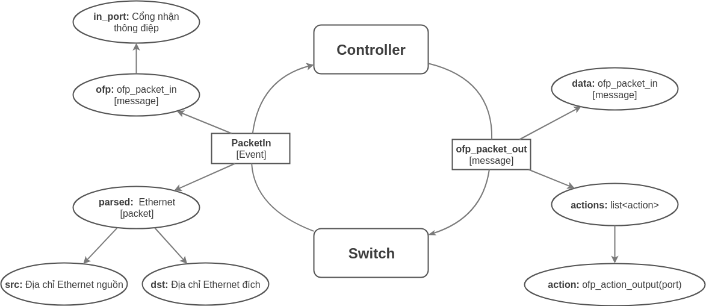

# OpenFlow Network Simulation with Mininet

## Create a Simple Network

### Khởi tạo network

-   Ta thực hiện demo trên một network đơn giản có cấu trúc bao gồm 01 switch kết nối với 03 hosts và được quản lý bởi một 01 controller bên ngoài. Khởi tạo network này bằng câu lệnh:
    ```bash
    $ sudo mn --topo single,3 --mac --switch ovsk --controller remote
    ```
-   Giải thích:
    -   `--topo single,3`: Topo mạng gồm một switch duy nhất với ba cổng kết nối với 3 hosts
    -   `--mac`: Gán địa chỉ mac tự động cho tất cả các thiết bị
    -   `--switch ovsk`: Switch là OVS kernel switch
    -   `--controller remote`: Chỉ định controller được cấu hình từ xa, switch giao tiếp với controller thông qua cổng TCP 6633

### Sử dụng ovs-ofctl

-   Đây là câu lệnh dùng để quản lý OpenFlow networks thông qua Open vSwitch
-   Tạo cửa sổ terminal mới và inspect switch vừa được tạo ra bằng câu lệnh:
    ```bash
    $ sudo ovs-ofctl dump-flows s1
    ```
-   Lệnh `dump-flows` dùng để in ra *flow table* trên switch. Do ta chưa cài đặt controller nên kết quả in ra là trống:
    ```bash
    $ sudo ovs-ofctl dump-flows s1
    ```
### Ping Test

-   Hiện tại, do flow table trên switch đang trống nên các gói tin đến switch đều bị hủy theo mặc định. Vì thế ta không ping được từ h1 sang h2 từ câu lệnh:
    ```bash
    mininet> h1 ping h2
    ```
-   Thêm flow từ h1 tới h2 và ngược lại một cách thủ công bằng câu lệnh:
    ```bash
    # ovs-ofctl add-flow s1 in_port=1,actions=output:2
    # ovs-ofctl add-flow s1 in_port=2,actions=output:1
    ```
-   Giờ ta đã có thể ping được từ h2 tới h1 và ngược lại

### Bắt gói tin với Wireshark

-   Khởi động Wireshark:
    ```bash
    $ sudo wireshark &
    ```
-   Tạo một controller đơn giản kết nối tới switch
    ```bash
    $ sudo controller ptcp:6633
    ```
-   Khởi tạo lại topology:
    ```bash
    $ sudo mn --topo single,3 --mac --switch ovsk --controller remote
    ```

## Create A Learning Switch

### Get Started with POX

-   POX là một SDN controller cài đặt bằng Python phụ vụ mục đích nghiên cứu và demo. Ta có thể sử dụng nó để thực hiện lập trình quản lý OpenFlow
-   Khởi tạo POX:
    ```bash
    $ ~/pox/pox.py log.level --DEBUG misc.of_tutorial
    ```
-   Khởi tạo network:
    ```bash
    sudo mn --topo single,3 --mac --controller remote --switch ovsk
    ```
### Verify Hub Behaviour

-   Hiện tại ta chưa cấu hình gì cho controller nên nó vẫn đang đóng vai trò như là một hub đơn giản. Tức là nó sẽ quảng bá gói tin qua tất cả các cổng, trừ cổng nhận gói tin
-   Khởi động xterm terminal cho 3 host h1, h2 và h3
    ```bash
    mininet> xterm h1 h2 h3
    ```
-   Sử dụng lệnh `tcpdump` để in các gói tin mà host nhận được ra màn hình:
    ```bash
    # tcpdump -XX -n -i h2-eth0
    or
    # tcpdump -XX -n -i h3-eth0
    ```
-   Giờ ta ping đến địa chỉip của h2 từ h1:
    ```bash
    # ping 10.0.0.2
    ```
-   Kết quả ta thấy cả h2 và h3 đều bắt được gói tin icmp gửi từ h1

### Tạo Learning Switch với POX

-   Bây giờ ta sẽ tạo ra một controller có khả năng yêu cầu switch tự học gói tin (như một switch thực thụ)
-   Trên mininet, chuyển đến địa chỉ `~/pox/pox/misc` và chỉnh sửa file `of_tutorial.py`
    ```bash
    $ vi of_tutorial.py
    ```
-   Tại đây, ta viết lại phương thức `act_like_switch` để định nghĩa cách thức xử lý với gói tin như một switch
    -   Phương thức này nhận hai tham số: `packet` là nội dung data của packet và `packet_in` là sự kiện `PacketIn` xuất hiện khi gói tin được gửi tới controller
    -   Code sử dụng phương thức `resend_packet`:
        ```python
        def act_like_switch (self, packet, packet_in):
            """
            Implement switch-like behavior.
            """
            in_port = packet_in.in_port
            mac_src = str(packet.src)
            mac_dst = str(packet.dst)

            # Remember packet's source
            self.mac_to_port[mac_src] = in_port

            if mac_dst in self.mac_to_port:
                out_port = self.mac_to_port[mac_dst]
                # If the destination MAC address is known, send the packet to the corresponding port
                self.resend_packet(packet_in, out_port)
            else:
                # Otherwise, flooding the packet out all ports
                self.resend_packet(packet_in, of.OFPP_ALL)

        ```
    -   Tự động hóa thao tác chuyển tiếp gói tin tới địa chỉ đã biết bằng cách thêm hành động vào flow table:
        ```python
        def act_like_switch (self, packet, packet_in):
            """
            Implement switch-like behavior.
            """
            in_port = packet_in.in_port
            mac_src = str(packet.src)
            mac_dst = str(packet.dst)

            # Remember packet's source
            self.mac_to_port[mac_src] = in_port

            if mac_dst in self.mac_to_port:
                out_port = self.mac_to_port[mac_dst]
                # Create new entry in flow table
                log_message = """
                Installing Flow
                Match: All packets that has destination MAC address: {}
                Action: Forward immediately to port: {}
                """
                log.debug(log_message.format(mac_dst, out_port))
                msg = of.ofp_flow_mod()
                msg.match = of.ofp_match.from_packet(packet)
                msg.data = packet_in
                msg.actions.append(of.ofp_action_output(port=out_port))
                self.connection.send(msg)

            else:
                # Otherwise, flooding the packet out all ports
                self.resend_packet(packet_in, of.OFPP_ALL)
        ```
        
    -   Sơ đồ chuyển tiếp gói tin của SDN learning switch:


    
### Nâng cấp hệ thống với nhiều switches

-   Tạo một topology tuyến tính với hai switch kết nối với nhau, mỗi switch nối với một host và cả hai switch đều được điều khiển bởi một controller:
    ```bash
    sudo mn --topo linear --switch ovsk --controller remote
    ```
-   Topo mạng có dạng như sau:


-   Do ta tạo ra một component tương ứng với mỗi kết nối nên switches vẫn hoạt động tốt trong trường hợp này

## Router Exercise

Tại phần này ta sẽ làm việc với mạng router tầng ba.

-   Tạo một t
