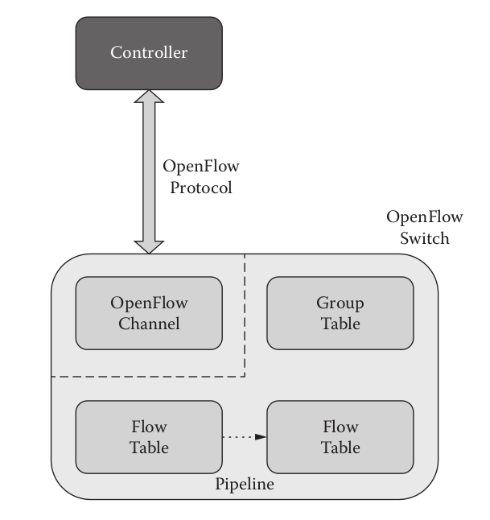

# OpenFlow

## Giới thiệu

Các giao thức mạng truyền thống thường được thiết kế một cách cô lập, mỗi giao thức nhắm đến xử lý một vấn đề cụ thể mà không có một sự khái quát hóa thống nhất nào, dẫn tới sự phức tạp lớn trong quá trình cập nhật thay đổi kiến trúc mạng. Ví dụ, nếu như muốn di chuyển một thiết bị giữa hai vị trí trong mạng, ta cần phải động chạm tới một cơ số các switches, routers, tường lửa, hệ thống xác thực định danh, ... nhằm cập nhật các danh mục kiểm soát truy cập (ACLs), VLANs, QoS  và các cơ chế dựa trên giao thức khác trên tầng vật lý và tầng liên kết dữ liệu. Nhìn chung, sự phức tạp này khiến cho hệ thống mạng truyền thống rất khó có thể quản lý và cập nhật.

OpenFlow là một giao thức được tạo ra để xử lý vấn đề này. Trong kiến trúc mô hình SDN, OpenFlow là tiêu chuẩn giao diện đầu tiên cho các giao tiếp giữa các lớp kiểm soát và chuyển tiếp. Nó cho phép truy cập và thay đổi trực tiếp các thao tác chuyển tiếp trong mạng, qua đó tách rời quy trình quản lý ra khỏi các switches vật lý nhằm tập trung hóa chúng trong một chương trình quản lý duy nhất.

OpenFlow được cài đặt trên cả hai phía của giao tiếp: thiết bị hạ tầng mạng và phần mềm quản lý SDN. 

## OpenFlow Switch Specs

Một OpenFlow switch bao gồm ba thành phần chính: một kênh OF, một group table và một vài flow tables. Các bảng được dùng để tra cứu và chuyển tiếp gói tin, trong khi kênh OF thực hiện nhiệm vụ giao tiếp với một controller bên ngoài thông qua giao thức OpenFlow protocol.

    

Cụ thể, khi một gói tin được gửi tới, tiêu đề của nó được lấy ra và đối sánh với dữ liệu được lưu trong các flow tables. Nếu dữ liệu này khớp với một dòng nào đó trong một flow table nào đó, một tập hợp các hành động tương ứng sẽ được thực thi. Trường hợp ngược lại, OF switch thường hủy gói tin hoặc gửi nó tới controller để xử lý.

Công việc cập nhật cấc flow tables được thực hiện bởi controller bên ngoài kết nối với switch.

## OpenFlow Ports

