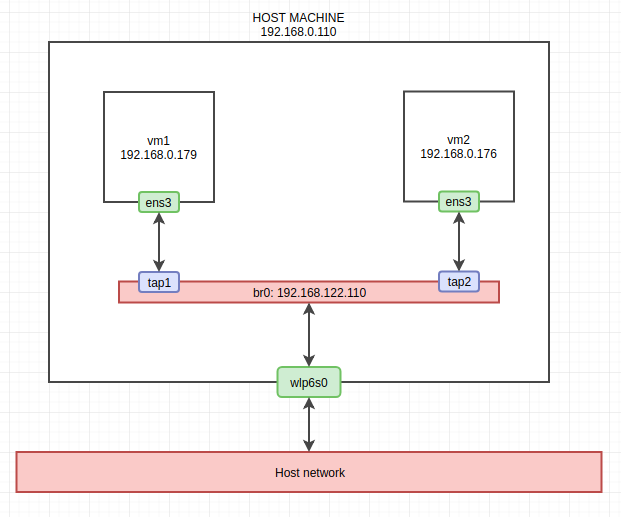
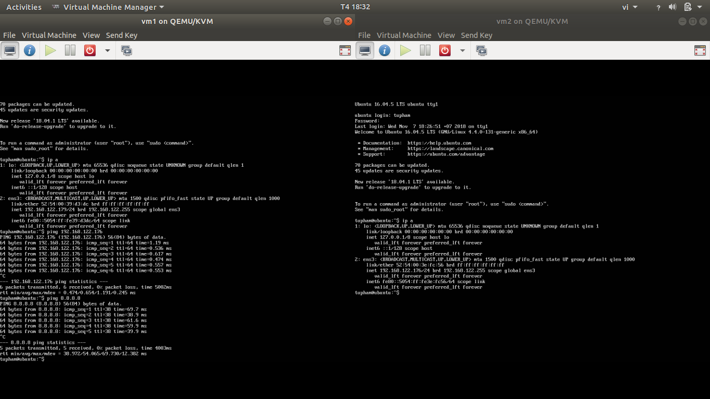

# OpenvSwitch Documentation

## Overview

OVS là một nền tảng switch hỗ trợ các giao diện mạng tiêu chuẩn đồng thời giúp chức năng chuyển tiếp trở nên dễ dàng mở rộng và kiểm soát bằng lập trình.

OVS phù hợp với vai trò trở thành các switch ảo trên môi trường máy ảo. Bên cạnh việc thể hiện khả năng kiểm soát các giao diện trên tầng mạng ảo, OVS còn được thiết kế để hỗ trợ nhiều hạ tầng ảo hóa khác nhau như Xen, KVM và VirtualBox.

Các tính năng được hỗ trợ bởi OVS bao gồm:

-   Standard 802.1Q VLAN model with trunk and access ports
-   NIC bonding with or without LACP on upstream switch
-   NetFlow, sFlow(R), and mirroring for increased visibility
-   QoS (Quality of Service) configuration, plus policing
-   Geneve, GRE, VXLAN, STT, and LISP tunneling
-   802.1ag connectivity fault management
-   OpenFlow 1.0 plus numerous extensions
-   Transactional configuration database with C and Python bindings
-   High-performance forwarding using a Linux kernel module

Các thành phần của OVS:
-   **`ovs-vswitchd`**: switch daemon
-   **`ovsdb-server`**: cơ sở dữ liệu cấu hình
-   **`ovs-dpctl`**: công cụ cấu hình kernel module của switch
-   **`ovs-vsctl`**: công cụ tiện ích giúp truy vấn và cập nhật cấu hình trên **`ovs-vswitchd`**
-   **`ovs-appctl`**: tiện ích gửi lệnh chạy ovs daemon

<a name="why-openvswitch"></a>
## Why OpenvSwitch?

Linux bridge cũng là một công cụ tạo bridge ảo nhanh và tin cậy được sử dụng bởi các linux-based hypervisors, vậy tại sao cần OVS? Lí do là vì OVS hướng tới các môi trường triển khai ảo hóa đa máy chủ, một không gian quá lớn đối với các công cụ bậc thấp như linux bridge. Để đạt được mục đích này, OVS sở hữu những đặc trưng sau:

-   *Tính di động:* Các entity di trú thường xuyên giữa các hosts. OVS có cơ chế khởi tạo lại cả các thông tin cấu hình cũng nhưng những trạng thái mạng khi một entity di trú tới một vị trí khác. Hơn nữa, trạng thái của OVS được định nghĩa một cách cụ thể bởi mô hình dữ liệu có sẵn, giúp cho thao tác triển khai tự động trở nên dễ dàng hơn
-   *Tính động:* Môi trường mạng cần được cập nhật liên tục bởi các thay đổi đến từ các máy ảo. OVS cung cấp các tính năng giúp hệ thống quản trị mạng có thể thích nghi với các thay đổi một cách nhanh chóng. Đặc biệt là việc cơ sở dữ liệu lưu network state của các entity (OVSDB) hỗ trợ khả năng kích hoạt từ xa, điều này giúp cho người quản trị viên có thể tạo ra một phần mềm có khả năng quan sát, phát hiện và phản hồi tới những thay đổi đến từ các phần tử trong mạng. Tính năng này cực kỳ hữu ích trong việc phản hồi và theo vết quá trình di trú của các máy ảo.
-   *Tính duy trì:* Các máy ảo phân tán định vị chúng và duy trì các logical context thông qua các thẻ trong gói tin. OVS cung cấp quản lý các thẻ này một cách nhất quán và gọn nhẹ, đồng thời cho phép việc truy cập và tự động hóa thủ tục này từ xa.
-   *Tính tích hợp:* OVS có khả năng tích hợp phần cứng giúp nâng cao hiệu suất ảo hóa, đồng thời giúp thống nhất cơ chế quản lý phần cứng và quản lý môi trường mạng ảo.

## Installing OpenvSwitch (without kernel module)

-   Cài đặt KVM:
    ```bash
    # apt-get install qemu-kvm libvirt-bin ubuntu-vm-builder bridge-utils
    ```
-   Cài đặt OVS:
    ```bash
    # sudo apt-get install openvswitch-switch
    ```

## Case Study

### VM Bridging

-   Kiến trúc mạng:
    

-   Tạo OVS bridge:
    ```bash
    #   ovs-vsctl add-br br0
    #   ifconfig br0 up
    ```
-   Gắn một interface vật lý vào bridge vừa tạo. Chú ý thao tác này khiến tất cả các địa chỉ IP hiện thời trên interface này bị ngừng hoạt động:
    ```bash
    #   ovs-vsctl add-port br0 wlp6s0
    #   ifconfig wlp6s0 0
    ```
-   Yêu cầu bridge làm mới địa chỉ ip:
    ```bash
    #   dhclient br0
    ```
-   Thêm hai tap devices trên bridge, mỗi device kết nối với một VM
    ```bash
    #   ip tuntap add mode tap tap1
    #   ifconfig tap1 up
    #   ovs-vsctl add-port br0 tap1

    #   ip tuntap add mode tap tap2
    #   ifconfig tap2 up
    #   ovs-vsctl add-port br0 tap2
    ```
-   Cấu hình mạng bridge cho hai VMs:
    -   Trên vm1:
    ```xml
    <interface type='bridge'>
      <source bridge='br0'/>
      <virtualport type='openvswitch'>
      </virtualport>
      <target dev='tap1'/>
      <model type='virtio'/>
      <address type='pci' domain='0x0000' bus='0x00' slot='0x03' function='0x0'/>
    </interface>
    ```
    -   Trên vm2:
    ```xml
    <interface type='bridge'>
      <source bridge='br0'/>
      <virtualport type='openvswitch'>
      </virtualport>
      <target dev='tap2'/>
      <model type='virtio'/>
      <address type='pci' domain='0x0000' bus='0x00' slot='0x03' function='0x0'/>
    </interface>
    ```

-   Khởi động lại VMs và kiểm tra kết quả:
    

## Other Notes

### Debian Network Scripts Intergration

Sử dụng OVS với kernel module giúp ta có thể cấu hình các bridges và cổng OVS qua file `/etc/network/interfaces`. Phần này đề cập chi tiết đến cú pháp cấu hình OVS bridges qua file `/etc/network/interfaces`.

Trong file này, mỗi port và bridge được cấu hình trong một "cụm" (stanzas). Trong đó:
-   bridge: cụm cấu hình bắt đầu bằng `allow-ovs {bridge_name}`
-   port: cụm cấu hình bắt đầu bằng `allow-{bridge_name} {port_name}`.

Các tham số cấu hình được hỗ trợ:
-   `ovs_type`: {*OVSBridge* - bridge, *OVSPort* - port, *OVSIntPort * - internal port, *OVSBond* - bond, *OVSPatchPort* - patch port, *OVSTunnel* - tunnel}
-   `ovs_ports`: Chỉ ra các ports gắn với bridge
-   `ovs_bridge`: Chỉ ra bridge gắn với port
-   `ovs_bonds`: Các interfaces vật lý được "gắn" với nhau
-   `ovs_patch_peer`: dùng cho patch ports, chỉ ra peer của patch trên bridge bên kia
-   `ovs_tunnel_type`: dùng cho tunnels, chỉ ra loại tunnel được dùng ("gre", "vxlan", ...)
-   `ovs_tunnel_options`: dùng cho tunnels, chỉ ra các tùy chọn của tunnel như remote_ip, key, ...
-   `ovs_option`
-   `ovs_extra`

Các ví dụ cấu hình file `/etc/network/interfaces` có thể được tìm thấy ở [đây](https://github.com/openvswitch/ovs/blob/master/debian/openvswitch-switch.README.Debian)

### TAP vs OVS Bridge

OVS bridges mô phỏng switch vật lý, tap devices là các "port" gắn vào OVS bridges
