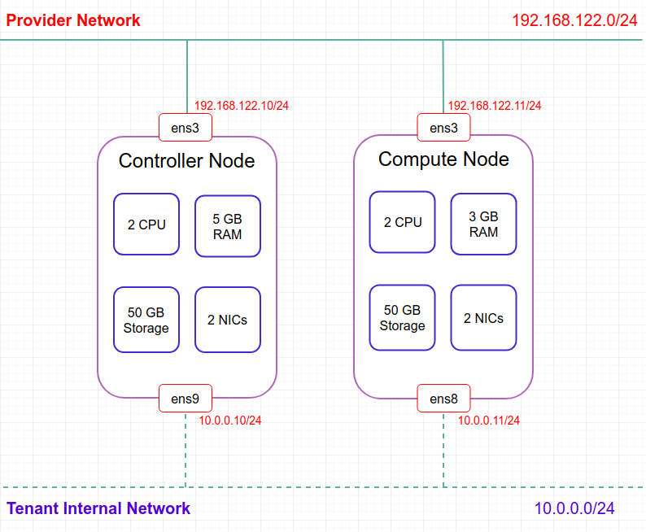

# OpenStack Pike Installation Note for Ubuntu

## Table of Contents

*   [OpenStack Network Layout](#openstack-network-layout)
*   [Nodes Preparation](#nodes-preparation)
    *   [Create VMs as Compute Node and Controller Node](#create-vms-as-compute-node-and-controller-node)
    *   [VM's Network Configuration](#vms-network-configuration)
    *   [Working with VMs using SSH](#working-with-vms-using-ssh)
*   [Environment Preparation](#environment-preparation)
    *   [Host networking](#host-networking)
        *   [Controller Node](#controller-node)
        *   [Compute Node](#compute-node)
    *   [Network Time Protocol (NTP)](#network-time-protocol-ntp)
    *   [OpenStack Packages](#openstack-packages)
    *   [SQL Database](#sql-database)
    *   [Message Queue](#message-queue)
    *   [Memcached](#memcached)
*   [Install OpenStack Services](#install-openstack-services)
*   [Lauch an Instance](#lauch-an-instance)
    *   [Create virtual networks](#create-virtual-networks)
        *   [Create the Provider Network](#create-the-provider-network)
        *   [Create the Self Service Network](#create-the-self-service-network)
        *   [Create a Router on the Self Service Network](#create-a-router-on-the-self-service-network)
        *   [Verify Operations](#verify-operations)
    *   [Create server flavor](#create-server-flavor)
    *   [Create an Ubuntu Server image](#create-an-ubuntu-server-image)
    *   [Generate a key pair](#generate-a-key-pair)
    *   [Add security group rules](#add-security-group-rules)
    *   [Launch an instance](#launch-an-instance)

## OpenStack Network Layout

Thiết kế network layout cho tenant:



## Nodes Preparation

### Create VMs as Compute Node and Controller Node

Chuẩn bị hai VMs để triển khai mô hình OpenStack Pike, mỗi VM ứng với một node. Cấp phát dung lượng và cấu hình cho hai VMs theo layout đã dự định ở trên:

*   Controller:
    ```bash
    sudo virt-install \
    --virt-type=kvm \
    --name tu-pike-controller \
    --ram 5120 \
    --vcpus=2 \
    --os-variant ubuntu16.04 \
    --virt-type=kvm \
    --hvm \
    --cdrom=/var/lib/libvirt/boot/ubuntu-16.04.2-server-amd64.iso \
    --network network=default,model=virtio \
    --graphics vnc,listen=0.0.0.0 \
    --noautoconsole \
    --disk size=50,bus=virtio
    ```

* Compute:
    ```bash
    sudo virt-install \
    --virt-type=kvm \
    --name tu-pike-compute \
    --ram 3072 \
    --vcpus=2 \
    --os-variant ubuntu16.04 \
    --virt-type=kvm \
    --hvm \
    --cdrom=/var/lib/libvirt/boot/ubuntu-16.04.2-server-amd64.iso \
    --network network=default,model=virtio \
    --graphics vnc,listen=0.0.0.0 \
    --noautoconsole \
    --disk size=50,bus=virtio
    ```

### VM's Network Configuration

*   Kiểm tra mạng `default`: 

```bash
root@bkcloud12:~# virsh net-dumpxml default
<network connections='4'>
  <name>default</name>
  <uuid>4fdf967b-cc8e-470f-ace1-9359f2b05b58</uuid>
  <forward mode='nat'>
    <nat>
      <port start='1024' end='65535'/>
    </nat>
  </forward>
  <bridge name='virbr0' stp='on' delay='0'/>
  <mac address='52:54:00:b0:ee:9d'/>
  <ip address='192.168.122.1' netmask='255.255.255.0'>
    <dhcp>
      <range start='192.168.122.2' end='192.168.122.254'/>
    </dhcp>
  </ip>
</network>

```
Như vậy, mạng default trên server cài đặt hai nodes có địa chỉ mạng `192.168.122.0`. Đây cũng là địa chỉ cần cấu hình cho VMs để giao tiếp với bên ngoài.

*   Hiện tại, mỗi VM chỉ có một card mạng kết nối với hypervisor qua bridge `vbr0`. Để triển khai mô hình mạng như đã lên kế hoạch, cần phải gắn thêm một virtual bridge nữa đóng vai trò là virtual network interface cho node:

    *   Định nghĩa một mạng mới:
        ```xml
        # vbr-tu.xml
        <network>
            <name>vbr-tu</name>
            <forward mode='nat'>
                <nat>
                    <port start='1024' end='65535'/>
                </nat>
            </forward>
            <bridge name='vbr-tu' stp='on' delay='0'/>
            <ip address='10.0.0.1' netmask='255.255.255.0'>
                <dhcp>
                    <range start='10.0.0.2' end='10.0.0.254'/>
                </dhcp>
            </ip>
        </network>
        ```
        
        ```bash
        root@bkcloud12:~# virsh net-define ./tupm-k60/network-xml/vbr-tu.xml 
        Network vbr-tu defined from ./tupm-k60/network-xml/vbr-tu.xml        
        ```

    *   Kiểm tra interface vừa tạo:
        ```bash
        root@bkcloud12:~/tupm-k60/network-xml# ip addr show dev vbr-tu
        
        59: vbr-tu: <BROADCAST,MULTICAST,UP,LOWER_UP> mtu 1500 qdisc noqueue state UP group default qlen 1000
            link/ether 52:54:00:1d:e8:d8 brd ff:ff:ff:ff:ff:ff
            inet 10.0.0.1/24 brd 10.0.0.255 scope global vbr-tu
               valid_lft forever preferred_lft forever
        ```
    
    *   Gắn interface vào node:
        ```bash
        root@bkcloud12:~# virsh attach-interface --domain tu-pike-controller --type bridge --source vbr-tu --model virtio --config --live                     
        Interface attached successfully

        root@bkcloud12:~# virsh attach-interface --domain tu-pike-compute --type bridge --source vbr-tu --model virtio --config --live 
        ```
    *   Kiểm tra:
        ```bash
        root@bkcloud12:~# virsh domiflist tu-pike-controller
        Interface  Type       Source     Model       MAC
        -------------------------------------------------------
        vnet4      network    default    virtio      52:54:00:e8:27:32
        vnet6      bridge     vbr-tu     virtio      52:54:00:da:d6:ef

        ```
### Working with VMs using SSH

*   Cài đặt SSH Server trên máy ảo để không phải gõ lệnh trên cửa sổ console của VM:

    *   Cài đặt openssh-server
        ```bash
        sudo apt-get install openssh-server
        ```

    *   Khởi động dịch vụ:
        ```bash
        sudo service ssh start
        sudo service sshd start
        ```

    *   Kết nối tới VM từ host sử dụng rsa keys
        ```bash
        ssh-copy-id -i PUBLICKEY_FILE VM_USERNAME@VM_IPADDRESS
        ```

    *   Mật khẩu: Mật khẩu của VM

*   Địa chỉ/mật khẩu để ssh đến hai con VM:

    *   Controller: tupham@10.0.0.10/123
    *   Compute: tupham@10.0.0.11/123

*   Khởi động ssh server cùng máy:
    ```bash
    sudo update-rc.d ssh defaults
    ```

## Environment Preparation

### Host networking

#### Controller Node

*   Cấu hình interfaces cho controller:

    ```bash
    auto ens9
            iface ens7 inet static
            address 10.0.0.10
            netmask 255.255.255.0

    auto ens3
            iface ens3 inet static
            address 192.168.122.10
            netmask 255.255.255.0
            gateway 192.168.122.1
    ```

*   Tạo file `ens*`
    ````bash
    sudo touch /etc/network/interfaces.d/ens3
    sudo touch /etc/network/interfaces.d/ens9
    ```
*   Khởi động lại interfaces:
    ```bash
    sudo ifdown -a && ifup -a
    ```

#### Compute Node


*   Cấu hình interfaces cho compute:

    ```bash
    auto ens7
            iface ens7 inet static
            address 10.0.0.11
            netmask 255.255.255.0

    auto ens3
            iface ens3 inet static
            address 192.168.122.11
            netmask 255.255.255.0
            gateway 192.168.122.1
    ```

*   Tạo file `ens*`
    ````bash
    sudo touch /etc/network/interfaces.d/ens3
    sudo touch /etc/network/interfaces.d/ens7
    ```
*   Khởi động lại interfaces:
    ```bash
    sudo ifdown -a && ifup -a
    ```

### Network Time Protocol (NTP)

Cài đặt NTP nhằm đồng bộ thời gian cho các nodes. Controller node được đồng bộ thời gian theo các statrum tại địa phương, các nodes còn lại đồng bộ thời gian theo controller node.

*   Cài đặt `chrony`:

        apt install chrony -y

*   Cấu hình file `/etc/chrony/chrony.conf`:
    *   Comment dòng sau:
        ```bash
        # pool 2.debian.pool.ntp.org offline iburst
        ```
    *   Đối với controller, thêm các ntp server ở VN và châu Á để nó reference tới:
        ```bash
        server 1.vn.poo.ntp.org iburst
        server 0.asia.pool.ntp.org iburst 
        server 3.asia.pool.ntp.org iburst

        allow 10.0.0.0/24  # allow references from other nodes in the private network
        ```
    *   Đối với các node khác, reference tới node controller:
        ```bash
        server controller iburst
        ```
    *   Khởi động lại dịch vụ:
        ```bash
        service chrony restart
        ```

### OpenStack Packages

Cài đặt các repos và packages cần thiết cho quá trình cài đặt OpenStack, chi tiết xem tại [đây](https://docs.openstack.org/install-guide/environment-packages.html)

### SQL Database

Sử dụng MarialDB (cho Ubuntu), chi tiết cài đặt tại [đây](https://docs.openstack.org/install-guide/environment-sql-database.html)

### Message Queue

Message Queue (hàng đợi thông điệp) là cơ chế time-space decoupling cho các thông điệp trong mạng, OpenStack sử dụng hàng đợi RabbitMQ, chi tiết cài đặt tại [đây](https://docs.openstack.org/install-guide/environment-messaging.html)

### Memcached

Sử dụng memcache để caching token cho keystone, chi tiết cài đặt tại [đây](https://docs.openstack.org/install-guide/environment-memcached-ubuntu.html)

## Install OpenStack Services

Cài đặt các dịch vụ OpenStack, chi tiết xem tại [đây](https://docs.openstack.org/install-guide/openstack-services.html)

## Lauch an Instance

### Create virtual networks

#### Create the Provider Network

*   Trên controller node, source admin credentials:
        # . admin-openrc

*   Mạng provider cần tạo là một mạng flat, tìm kiếm tên của mạng cần tạo cũng như interface trên host controller gắn với mạng này trong các file:
    *   File `/etc/neutron/plugins/ml2/ml2_conf.ini`:
        ```bash
        [ml2_type_flat]
        flat_networks = provider
        ```
    *   File `/etc/neutron/plugins/ml2/linuxbridge_agent.ini`:
        ```bash
        [linux_bridge]
        physical_interface_mappings = provider:ens3
        ```
*   Tạo mạng provider
    ```bash
    root@controller:~# openstack network create  --share --external \
    >   --provider-physical-network provider \
    >   --provider-network-type flat provider
    +---------------------------+--------------------------------------+
    | Field                     | Value                                |
    +---------------------------+--------------------------------------+
    | admin_state_up            | UP                                   |
    | availability_zone_hints   |                                      |
    | availability_zones        |                                      |
    | created_at                | 2018-08-07T06:57:02Z                 |
    | description               |                                      |
    | dns_domain                | None                                 |
    | id                        | d221d24f-5f5a-467f-8424-8793995bec9f |
    | ipv4_address_scope        | None                                 |
    | ipv6_address_scope        | None                                 |
    | is_default                | False                                |
    | is_vlan_transparent       | None                                 |
    | mtu                       | 1500                                 |
    | name                      | provider                             |
    | port_security_enabled     | True                                 |
    | project_id                | 525b774a60924ba38960d1c713368246     |
    | provider:network_type     | flat                                 |
    | provider:physical_network | provider                             |
    | provider:segmentation_id  | None                                 |
    | qos_policy_id             | None                                 |
    | revision_number           | 3                                    |
    | router:external           | External                             |
    | segments                  | None                                 |
    | shared                    | True                                 |
    | status                    | ACTIVE                               |
    | subnets                   |                                      |
    | tags                      |                                      |
    | updated_at                | 2018-08-07T06:57:02Z                 |
    +---------------------------+--------------------------------------+
    ```
    *   Chỉ thị `--share` cho phép tất cả các projects có thể sử dụng network này
    *   Chỉ thị `--external` định nghĩa mạng external
    *   Chỉ thị `--provider-network-type flat` định nghĩa mạng kiểu flat (native/untagged)
    *   Chỉ thị `--provider-physical-network provider` định nghĩa mạng vật lý cho mạng ảo hiện tại là `provider` (Xem trong file `ml2_conf.ini` như trên)

*   Tạo một subnet tên là `provider` trên mạng `provider`:
    ```bash
    root@controller:~#     openstack subnet create --network provider \
    >     --allocation-pool start=192.168.122.50,end=192.168.122.60\
    >     --dns-nameserver 8.8.8.8 --gateway 192.168.122.1 \
    >     --subnet-range 192.168.122.0/24 provider
    +-------------------------+--------------------------------------+
    | Field                   | Value                                |
    +-------------------------+--------------------------------------+
    | allocation_pools        | 192.168.122.50-192.168.122.60        |
    | cidr                    | 192.168.122.0/24                     |
    | created_at              | 2018-08-07T07:28:20Z                 |
    | description             |                                      |
    | dns_nameservers         | 8.8.8.8                              |
    | enable_dhcp             | True                                 |
    | gateway_ip              | 192.168.122.1                        |
    | host_routes             |                                      |
    | id                      | 7ec38a9c-9df7-4cc3-817a-aba7870aa205 |
    | ip_version              | 4                                    |
    | ipv6_address_mode       | None                                 |
    | ipv6_ra_mode            | None                                 |
    | name                    | provider                             |
    | network_id              | d221d24f-5f5a-467f-8424-8793995bec9f |
    | project_id              | 525b774a60924ba38960d1c713368246     |
    | revision_number         | 0                                    |
    | segment_id              | None                                 |
    | service_types           |                                      |
    | subnetpool_id           | None                                 |
    | tags                    |                                      |
    | updated_at              | 2018-08-07T07:28:20Z                 |
    | use_default_subnet_pool | None                                 |
    +-------------------------+--------------------------------------+
    ```
    *   `--allocaion-pool` là khoảng địa chỉ được gán cho instances thuộc subnet đang được tạo, không được phép overlap với các địa chỉ đang được sử dụng
    *   `--dns-nameserver` là địa chỉ DNS server
    *   `--subnet-range` là địa chỉ mạng kèm netmask của mạng `provider`

#### Create the Self Service Network

*   Trên controller node, source demo credentials để lấy quyền truy cập dưới của người dùng:

    ```bash
    root@controller:~# . demo-openrc
    ```

*   Tạo mạng self service:
    ```bash
    root@controller:~# openstack network create selfservice
    +---------------------------+--------------------------------------+
    | Field                     | Value                                |
    +---------------------------+--------------------------------------+
    | admin_state_up            | UP                                   |
    | availability_zone_hints   |                                      |
    | availability_zones        |                                      |
    | created_at                | 2018-08-07T07:49:14Z                 |
    | description               |                                      |
    | dns_domain                | None                                 |
    | id                        | ff1e126f-40fb-46e4-ada1-e6664d65c1bb |
    | ipv4_address_scope        | None                                 |
    | ipv6_address_scope        | None                                 |
    | is_default                | False                                |
    | is_vlan_transparent       | None                                 |
    | mtu                       | 1450                                 |
    | name                      | selfservice                          |
    | port_security_enabled     | True                                 |
    | project_id                | d562c52c9d8147a28e39bc8e37f8f8fa     |
    | provider:network_type     | None                                 |
    | provider:physical_network | None                                 |
    | provider:segmentation_id  | None                                 |
    | qos_policy_id             | None                                 |
    | revision_number           | 2                                    |
    | router:external           | Internal                             |
    | segments                  | None                                 |
    | shared                    | False                                |
    | status                    | ACTIVE                               |
    | subnets                   |                                      |
    | tags                      |                                      |
    | updated_at                | 2018-08-07T07:49:14Z                 |
    +---------------------------+--------------------------------------+
    ```
    *   Người dùng đầu cuối nhìn chung không được thêm chỉ thị cho câu lệnh tạo network, các tham số được lấy mặc định từ file `/etc/neutron/plugins/ml2/ml2_conf.ini`:
        ```bash
        [ml2]
        #
        # From neutron.ml2
        #
        type_drivers = flat,vlan,vxlan
        tenant_network_types = vxlan
        mechanism_drivers = linuxbridge,l2population
        extension_drivers = port_security
        ...        
        [ml2_type_vxlan]
        vni_ranges = 1:1000
        ```
*   Tạo subnet `selfservice` trong mạng `selfservice`:
    ```bash
    root@controller:~# openstack subnet create --network selfservice \
    >     --dns-nameserver 8.8.8.8 --gateway 10.0.0.1 \
    >     --subnet-range 10.0.0.0/24 selfservice
    +-------------------------+--------------------------------------+
    | Field                   | Value                                |
    +-------------------------+--------------------------------------+
    | allocation_pools        | 10.0.0.2-10.0.0.254                  |
    | cidr                    | 10.0.0.0/24                          |
    | created_at              | 2018-08-07T07:55:33Z                 |
    | description             |                                      |
    | dns_nameservers         | 8.8.8.8                              |
    | enable_dhcp             | True                                 |
    | gateway_ip              | 10.0.0.1                             |
    | host_routes             |                                      |
    | id                      | 713b0ada-f2b4-4f90-8e1a-72755d58f097 |
    | ip_version              | 4                                    |
    | ipv6_address_mode       | None                                 |
    | ipv6_ra_mode            | None                                 |
    | name                    | selfservice                          |
    | network_id              | ff1e126f-40fb-46e4-ada1-e6664d65c1bb |
    | project_id              | d562c52c9d8147a28e39bc8e37f8f8fa     |
    | revision_number         | 0                                    |
    | segment_id              | None                                 |
    | service_types           |                                      |
    | subnetpool_id           | None                                 |
    | tags                    |                                      |
    | updated_at              | 2018-08-07T07:55:33Z                 |
    | use_default_subnet_pool | None                                 |
    +-------------------------+--------------------------------------+
    ```
#### Create a Router on the Self Service Network

Self-service networks kết nối tới provider networks thông qua một router ảo làm nhiệm vụ NAT hai chiều. Mỗi router có chứa một interface trên ít nhất một mạng self-service và một gateway trên mạng provider.

Chú ý rằng ở mạng provider, cần bật tùy chọn `router:external` (bằng chỉ thị --external khi tạo mạng) để các router self-services có thể kết nối tới nhằm giao tiếp với môi trường bên ngoài.

*   Tại controller node, source `demo` credentials để lấy quyền truy cập người dùng:
    ```bash
    root@controller:~# . demo-openrc
    ```

*   Tạo một router với tên `router`:
    ```bash
    root@controller:~# openstack router create router
    +-------------------------+--------------------------------------+
    | Field                   | Value                                |
    +-------------------------+--------------------------------------+
    | admin_state_up          | UP                                   |
    | availability_zone_hints |                                      |
    | availability_zones      |                                      |
    | created_at              | 2018-08-07T08:24:19Z                 |
    | description             |                                      |
    | distributed             | False                                |
    | external_gateway_info   | None                                 |
    | flavor_id               | None                                 |
    | ha                      | False                                |
    | id                      | 9cd9bdd0-20b1-484b-83c6-5dda970fe281 |
    | name                    | router                               |
    | project_id              | d562c52c9d8147a28e39bc8e37f8f8fa     |
    | revision_number         | None                                 |
    | routes                  |                                      |
    | status                  | ACTIVE                               |
    | tags                    |                                      |
    | updated_at              | 2018-08-07T08:24:19Z                 |
    +-------------------------+--------------------------------------+
    ```

*   Thêm `selfservice` subnet như là một interface cho `router`:
    ```bash
    root@controller:~# openstack router add subnet router selfservice
    ```

*   Tạo một gateway đi ra provider network trên `router`:
    ```bash
    root@controller:~# openstack router set router --external-gateway provider
    ```

#### Verify Operations

Xem thông tin về các interface trên `router`:

```bash
root@controller:~# openstack port list --router router
+--------------------------------------+------+-------------------+-------------------------------------------------------------------------------+--------+
| ID                                   | Name | MAC Address       | Fixed IP Addresses                                                            | Status |
+--------------------------------------+------+-------------------+-------------------------------------------------------------------------------+--------+
| 23fe3e51-223c-4e47-8c95-172cee7a8e3e |      | fa:16:3e:59:19:8e | ip_address='192.168.122.55', subnet_id='7ec38a9c-9df7-4cc3-817a-aba7870aa205' | ACTIVE |
| cd2fee90-f56f-4d56-b8c5-315d47fba7df |      | fa:16:3e:6d:a9:37 | ip_address='10.0.0.1', subnet_id='713b0ada-f2b4-4f90-8e1a-72755d58f097'       | ACTIVE |
+--------------------------------------+------+-------------------+-------------------------------------------------------------------------------+--------+

```

Địa chỉ `192.168.122.55` là địa chỉ gateway đi ra mạng provider của router, có thể kiểm tra kết nối tới địa chỉ này bằng lệnh `ping`:

```bash
root@controller:~# ping 192.168.122.55
PING 192.168.122.55 (192.168.122.55) 56(84) bytes of data.
64 bytes from 192.168.122.55: icmp_seq=1 ttl=64 time=0.189 ms
64 bytes from 192.168.122.55: icmp_seq=2 ttl=64 time=0.078 ms
64 bytes from 192.168.122.55: icmp_seq=3 ttl=64 time=0.086 ms
64 bytes from 192.168.122.55: icmp_seq=4 ttl=64 time=0.082 ms
64 bytes from 192.168.122.55: icmp_seq=5 ttl=64 time=0.081 ms
^C
--- 192.168.122.55 ping statistics ---
5 packets transmitted, 5 received, 0% packet loss, time 3998ms
rtt min/avg/max/mdev = 0.078/0.103/0.189/0.043 ms

```
### Create server flavor

Trong OpenStack, flavor định nghĩa dung tích CPU, RAM và storage của một instance, để tạo một Ubuntu instance với OpenStack, định nghĩa flavor `m1.small`:

```bash
root@controller:~# openstack flavor create --id 0 --vcpus 1 --ram 2048 --disk 20 m1.small
+----------------------------+----------+
| Field                      | Value    |
+----------------------------+----------+
| OS-FLV-DISABLED:disabled   | False    |
| OS-FLV-EXT-DATA:ephemeral  | 0        |
| disk                       | 20       |
| id                         | 0        |
| name                       | m1.small |
| os-flavor-access:is_public | True     |
| properties                 |          |
| ram                        | 2048     |
| rxtx_factor                | 1.0      |
| swap                       |          |
| vcpus                      | 1        |
+----------------------------+----------+
```
### Create an Ubuntu Server image

*   Tải về một phiên bản image từ nhà phát hành:
```bash
root@controller:~# wget http://cloud-images.ubuntu.com/minimal/releases/xenial/release-20180705/ubuntu-16.04-minimal-cloudimg-amd64-disk1.img
```

*   Tạo một image với lệnh `image create`:
```bash
root@controller:~# openstack image create --file ./ubuntu-16.04-minimal-cloudimg-amd64-disk1.img --disk-format qcow2 ubuntu16.04
+------------------+------------------------------------------------------+
| Field            | Value                                                |
+------------------+------------------------------------------------------+
| checksum         | ec488829bb66f4e0365544b57f2da0d9                     |
| container_format | bare                                                 |
| created_at       | 2018-08-07T09:11:03Z                                 |
| disk_format      | qcow2                                                |
| file             | /v2/images/446c7272-f847-48a8-935c-0c495811faeb/file |
| id               | 446c7272-f847-48a8-935c-0c495811faeb                 |
| min_disk         | 0                                                    |
| min_ram          | 0                                                    |
| name             | ubuntu16.04                                          |
| owner            | d562c52c9d8147a28e39bc8e37f8f8fa                     |
| protected        | False                                                |
| schema           | /v2/schemas/image                                    |
| size             | 156041216                                            |
| status           | active                                               |
| tags             |                                                      |
| updated_at       | 2018-08-07T09:11:06Z                                 |
| virtual_size     | None                                                 |
| visibility       | shared                                               |
+------------------+------------------------------------------------------
```

*   Kiểm tra:
```bash
root@controller:~# openstack image list
+--------------------------------------+-------------+--------+
| ID                                   | Name        | Status |
+--------------------------------------+-------------+--------+
| 0f67e4f8-fcea-417d-a737-eadefcb5b8f1 | cirros      | active |
| 446c7272-f847-48a8-935c-0c495811faeb | ubuntu16.04 | active |
+--------------------------------------+-------------+--------+
```
### Generate a key pair

Xác thực khóa công khai thông dụng đối với các dịch vụ OpenStack hơn là xác thực mật khẩu, tạo khóa công khai với `demo` project như sau:

*   Lấy quyền `demo`:
    ```bash
    root@controller:~# . demo-openrc 
    ```
*   Tạo keys:

    ```bash
    root@controller:~# ssh-keygen -q -N ""

    Enter file in which to save the key (/root/.ssh/id_rsa): 

    root@controller:~# openstack keypair create --public-key ~/.ssh/id_rsa.pub mykey
    +-------------+-------------------------------------------------+
    | Field       | Value                                           |
    +-------------+-------------------------------------------------+
    | fingerprint | 06:83:60:b2:ae:1e:73:43:a9:25:6e:db:d3:2b:04:e4 |
    | name        | mykey                                           |
    | user_id     | 41eb753bc60c4d9b9210ac6134dbc952                |
    +-------------+-------------------------------------------------+
    ```
*   Verify addition of the keypair:
    ```bash
    root@controller:~# openstack keypair list
    +-------+-------------------------------------------------+
    | Name  | Fingerprint                                     |
    +-------+-------------------------------------------------+
    | mykey | 06:83:60:b2:ae:1e:73:43:a9:25:6e:db:d3:2b:04:e4 |
    +-------+-------------------------------------------------+
    ```

### Add security group rules

Theo mặc định, `default` security group of rules được áp đặt lên tất cả các instances, bao gồm cả firewall rule ngăn chặn kết nối từ xa đến instance. Để cho phép kết nối từ xa tới instance, tối thiểu là qua giao thức **ICMP** và **SSH**, cần thêm rule cho `default` như sau:

*   Cho phép ICMP:
    ```bash
    root@controller:~# openstack security group rule create --proto icmp default
    +-------------------+--------------------------------------+
    | Field             | Value                                |
    +-------------------+--------------------------------------+
    | created_at        | 2018-08-07T08:52:48Z                 |
    | description       |                                      |
    | direction         | ingress                              |
    | ether_type        | IPv4                                 |
    | id                | 2420513b-0020-4116-8483-e7cfe490d97b |
    | name              | None                                 |
    | port_range_max    | None                                 |
    | port_range_min    | None                                 |
    | project_id        | d562c52c9d8147a28e39bc8e37f8f8fa     |
    | protocol          | icmp                                 |
    | remote_group_id   | None                                 |
    | remote_ip_prefix  | 0.0.0.0/0                            |
    | revision_number   | 0                                    |
    | security_group_id | a438f1a2-6147-43ca-8c77-b50bd0d03700 |
    | updated_at        | 2018-08-07T08:52:48Z                 |
    +-------------------+--------------------------------------+
    ```
*   Cho phép SSH:
    ```bash
    root@controller:~# openstack security group rule create --proto tcp --dst-port 22 default
    +-------------------+--------------------------------------+
    | Field             | Value                                |
    +-------------------+--------------------------------------+
    | created_at        | 2018-08-07T08:53:49Z                 |
    | description       |                                      |
    | direction         | ingress                              |
    | ether_type        | IPv4                                 |
    | id                | 0911aa6f-cf6b-430b-a7a7-cf7c8999f304 |
    | name              | None                                 |
    | port_range_max    | 22                                   |
    | port_range_min    | 22                                   |
    | project_id        | d562c52c9d8147a28e39bc8e37f8f8fa     |
    | protocol          | tcp                                  |
    | remote_group_id   | None                                 |
    | remote_ip_prefix  | 0.0.0.0/0                            |
    | revision_number   | 0                                    |
    | security_group_id | a438f1a2-6147-43ca-8c77-b50bd0d03700 |
    | updated_at        | 2018-08-07T08:53:49Z                 |
    +-------------------+--------------------------------------+
    ```
### Launch an instance

*   Lấy quyền `demo`:
    ```bash
    root@controller:~# . demo-openrc 
    ```

*   Chạy instance:
    ```bash
    root@controller:~# openstack server create --flavor 0 --image ubuntu16.04 --nic net-id=ff1e126f-40fb-46e4-ada1-e6664d65c1bb --security-group default --key-name mykey ubuntu16.04
    +-----------------------------+----------------------------------------------------+
    | Field                       | Value                                              |
    +-----------------------------+----------------------------------------------------+
    | OS-DCF:diskConfig           | MANUAL                                             |
    | OS-EXT-AZ:availability_zone |                                                    |
    | OS-EXT-STS:power_state      | NOSTATE                                            |
    | OS-EXT-STS:task_state       | scheduling                                         |
    | OS-EXT-STS:vm_state         | building                                           |
    | OS-SRV-USG:launched_at      | None                                               |
    | OS-SRV-USG:terminated_at    | None                                               |
    | accessIPv4                  |                                                    |
    | accessIPv6                  |                                                    |
    | addresses                   |                                                    |
    | adminPass                   | LsDsX6r89xfx                                       |
    | config_drive                |                                                    |
    | created                     | 2018-08-08T04:21:20Z                               |
    | flavor                      | m1.small (0)                                       |
    | hostId                      |                                                    |
    | id                          | 5997926a-04aa-4c18-a39d-b6fc8b4db850               |
    | image                       | ubuntu16.04 (446c7272-f847-48a8-935c-0c495811faeb) |
    | key_name                    | mykey                                              |
    | name                        | ubuntu16.04                                        |
    | progress                    | 0                                                  |
    | project_id                  | d562c52c9d8147a28e39bc8e37f8f8fa                   |
    | properties                  |                                                    |
    | security_groups             | name='a438f1a2-6147-43ca-8c77-b50bd0d03700'        |
    | status                      | BUILD                                              |
    | updated                     | 2018-08-08T04:21:21Z                               |
    | user_id                     | 41eb753bc60c4d9b9210ac6134dbc952                   |
    | volumes_attached            |                                                    |
    +-----------------------------+----------------------------------------------------+
    ```

*   Kiểm tra trạng thái của instance:
    ```bash
    root@controller:~# openstack server list
    +--------------------------------------+----------------------+--------+----------------------+-------------+----------+
    | ID                                   | Name                 | Status | Networks             | Image       | Flavor   |
    +--------------------------------------+----------------------+--------+----------------------+-------------+----------+
    | 5997926a-04aa-4c18-a39d-b6fc8b4db850 | ubuntu16.04          | ACTIVE | selfservice=10.0.0.5 | ubuntu16.04 | m1.small |
    | edbd2ace-7a78-41af-a67c-db6c1d04c3d6 | selfservice-instance | ACTIVE | selfservice=10.0.0.7 | cirros      | m1.nano  |
    +--------------------------------------+----------------------+--------+----------------------+-------------+----------+
    ``` 
