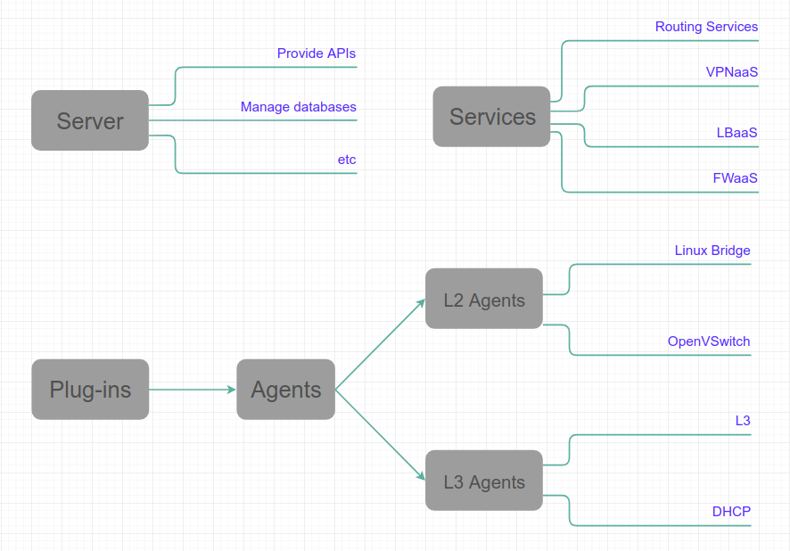

# OpenStack Networking

OpenStack Networking cho phép người dùng tạo lập và quản lý các đối tượng mạng (networks, subnets, ports, ...) có thể được sử dụng bởi các dịch vụ OpenStack khác. Neutron thiết kế một API giúp định nghĩa kết nối mạng và định địa chỉ trong môi trường đám mây. Nó cũng cung cấp API giúp quản lý các dịch vụ mạng đa dạng từ chuyển tiếp tại tầng 3 và NAT cho đến cân bằng tải, thiết lập tường lửa và mạng riêng ảo.

Neutron bao gồm các thành phần sau:

*   API server: Bao gồm những sự hỗ trợ cho networking tầng 2 và quản lý địa chỉ IP, cũng như thiết lập các router tầng 3 cho phép định tuyến giữa các mạng tầng hai và cài đặt gateway giao tiếp với môi trường bên ngoài. OpenStack Networking có nhiều plug-ins giúp tăng cường khả năng tương tác với nhiều công nghệ mạng khác nhau, bao gồm routers, switches, virtual switches và SDN controllers. 
*   OpenStack Networking plug-in and agents: Có chức năng đóng, mở cổng, tạo mạng và subnets, định địa chỉ IP. Sự lựa chọn plug-in và agent thay đổi phụ thuộc vào vendor và công nghệ được sử dụng đối với từng hệ thống đám mây. Chú ý tại một thời điểm chỉ được sử dụng một plug-in
*   Messaging queue: Làm nhiệm vụ nhận và chuyển các RPC requests giữa các agents. Message queue được sử dụng trong ML2 plug-in cho RPC request giữa neutron server và agents chạy trên từng hypervisor (theo cơ chế OpenvSwitch và Linux bridge)

    

## Overview

OpenStack Networking (Neutron) quản lý tất cả khía cạnh của hạ tầng mạng ảo cũng như việc truy cập hạ tầng mạng vật lý trong môi trường OpenStack. Neutron giúp cho các projects tạo ra các topo mạng ảo với các dịch vụ hỗ trợ tùy chọn như tường lửa, cân bằng tải và mạng riêng ảo (VPN).

Neutron tạo ra các thành phần như *networks*, *subnets* và *routers* như các đối tượng trừu tượng (không gắn với thiết bị phần cứng tương ứng cố định nào). Mỗi đối tượng đảm nhận chức năng tương tự các khái niệm phần cứng tương ứng của nó: networks chứa các subnets, routers định tuyến lưu lượng giữa các subnets và networks, ...

Mỗi kiến trúc cài đặt mạng Neutron đều chứa ít nhất một *mạng ngoài (external network)* và một vài *mạng trong (internal networks)*. External networks không chỉ đơn thuần là một mạng ảo, nó còn có khả năng giao tiếp với môi trường ngoài như một mạng vật lý thông thường. Internal networks là các hệ thống mạng SDN kết nối trực tiếp với các máy ảo, chỉ những máy ảo thuộc cùng chung một internal networks hoặc thuộc các subnets cùng kết nối với một router mới có thể giao tiếp với nhau một cách trực tiếp.

Nếu các máy ở môi trường bên ngoài muốn kết nối với các VMs hoặc ngược lại, giao tiếp giữa chúng phải thông qua các *routers*. Mỗi router có một gateway kết nối với một external network và một vài interfaces kết nối với các internal networks. Lưu lượng vào ra mạng sẽ được kiểm soát bởi các router này bằng các gateway.

Neutron còn hỗ trợ *security groups*. SGs giúp quản trị viên định nghĩa ra các quy tắc tường lửa nhằm chặn hoặc hủy chặn cổng, định ra không gian cổng hợp lệ hay cho phép loại kết nối với các VMs trong nhóm. Mỗi VM có thể thuộc một hoặc nhiều nhóm.

## Concepts

OpenStack Networking hỗ trợ mỗi project có nhiều private networks và cho phép projects lựa chọn chiến lược định địa chỉ riêng biệt. OpenStack Networking cho phép sự chồng lấn địa chỉ giữa các project khác nhau, thậm chí cho phép chia sẻ mạng giữa các project trong quá trình khởi tạo.

Các mục dưới đây đề cập cụ thể về các khái niệm mạng trong OpenStack.

### Provider Networks

Provider networks cung cấp kết nối tầng 2 cho các instances với tùy chọn dịch vụ DHCP và các dịch vụ metadata khác. Nó kết nối đến hoặc map với các mạng tầng 2 có sẵn trong trung tâm dữ liệu và thường dùng cơ chế VLAN tagging để định danh và phân biệt chúng.

Provider networks cung cấp tính đơn giản, sự hiệu quả và tính tin cậy, đổi lại tính thuận tiện không cao. Theo mặc định, chỉ quản trị viên mới có thể tạo và cập nhật provider networks bởi vì nó yêu cầu các thao tác cấu hình đối với hạ tầng mạng vật lý. 

Thêm vào đó, provider networks chỉ xử lý kết nối tầng hai giữa các instances mà thiếu đi các tính năng hỗ trợ như định tuyến và định địa chỉ IP.

Thông thường, các thành phần phần mềm của OpenStack Networking xử lý các thao tác tầng 3 ảnh hưởng đến hiệu năng và tính tin cậy của hệ thống mạng. Để cải thiện điều này, provider networks chuyển các thao tác tầng 3 cho hạ tầng mạng vật lý.

### Routed Provider Networks

Routed provider networks cung cấp kết nối tầng 3 cho các instances. Chúng được map với các mạng tầng 3 đã tồn tại trong data center. Cụ thể hơn, mỗi mạng routed provider map với nhiều segment tầng 2, mỗi segment là một provider network có gắn một router gateway có nhiệu vụ định tuyến lưu lượng giữa chúng.

Routed provider network có hiệu năng cao hơn provider network thông thường tuy nhiên không đảm bảo liên kết chặt chẽ ở tầng 2.

### Self-service Networks

Self-service networks có nhiệm vụ chính là cho phép các projects thông thường có thể quản lý mạng mà không cần đến quyền quản trị. Các mạng kiểu này hoàn toàn là mạng ảo và cần có các virtual routers để twowngn tác với provider và external networks. Self-service networks cũng cung cấp các dịch vụ DHCP và metadata.

Trong hầu hết các trường hợp, self-service networks sử dụng các giao thức overlay như VXLAN hay GRE với số lượng mạng được hỗ trợ lớn hơn nhiều so với mạng VLAN mà không phải thông qua các thao tác cấu hình trên mạng vật lý.

IPv4 self-service networks thường sử dụng các dải địa chỉ IP nội bộ và tương tác với provider networks qua giao thức NAT trên các virtual routers. IPv6 self-service networks mặt khác luôn sử dụng dải địa chỉ IP công cộng và tương tác với provider networks thông qua các virtual routers thông qua các tuyến tĩnh.

Dịch vụ mạng self-service implements các routers sử dụng các agent tầng 3 mà thường nằm trên ít nhất một nút mạng. Đối lập với provider networks kết nối instances với hạ tầng mạng vật lý tầng 2, self-service networks bắt buộc phải thông qua một agent tầng 3. Bởi vậy, hiện tượng quá tải hoặc lỗi xảy ra đối với agent này hoặc trên nút mạng sẽ ảnh hưởng lớn đến chất lượng mạng và việc sử dụng mạng của các instances. Vì thế, việc cân nhắc tăng cường tính dự phòng và hiệu năng cho mạng self-service là cần thiết.

Theo mặc định, các mạng tạo ra bởi người dùng trong một project là cô lập và không thể chia sẻ với các projects khác. OpenStack Networking hỗ trợ các phương thức cô lập mạng và các công nghệ overlay sau:

*   Flat: Tất cả các instance nằm trên cùng một mạng (mạng này có thể được chia sẻ cả với các host chạy các instances). Trong mạng Flat không có bất kỳ cơ chế VLAN tagging hay phân chia mạng nào.
*   VLAN
*   GRE and VXLAN

### Subnets

Là một dải địa chỉ IP có cùng chung một trạng thái cấu hình, được sử dụng để cấp phát địa chỉ IP mới cho các cổng được tạo ra trên một mạng.

### Subnet pools

Người dùng hoàn toàn có thể tạo ra các subnets với các địa chỉ IP hợp lệ mà không thông qua bất kỳ điều khoản ràng buộc nào. Tuy nhiên, mọi thứ sẽ dễ dàng và an toàn hơn nếu người quản trị tạo ra trước các pool địa chỉ và người dùng tạo ra các subnet trong đó. Sử dụng subnet pools ràng buộc địa chỉ được sử dụng bằng cách yêu cầu tất cả địa chỉ của subnet phải nằm trong một pool, qua đó tránh trường hợp sử dụng lại hoặc chồng lấn dải địa chỉ giữa các subnet.

### Ports

Mỗi cổng là một điểm trên kết nối được gắn một thiết bị mạng, chẳng hạn như card mạng của một virtual server, cho một virtual network. Port cũng có các thông số cấu hình mạng như địa chỉ MAC và địa chỉ IP giúp định vị nó.

### Routers

Routers provide virtual layer-3 services such as routing and NAT between self-service and provider networks or among self-service networks belonging to a project. The Networking service uses a layer-3 agent to manage routers via namespaces.

### Security groups

Security groups chứa các quy tắc tường lửa ảo kiểm soát lưu lượng mạng bên trong (ingress) và bên ngoài (egress) mạng tại port level. Các security groups mặc định của là từ chối lưu lượng vào ra mạng, chỉ cho phép một vài dạng lưu lượng cụ thể được chỉ ra. Mỗi cổng có thể tham chiếu đến một hoặc nhiều SGs khác nhau. Driver tường lửa sẽ dịch các quy tắc của SG thành các tham số cấu hình cho các công nghệ lọc gói tin phía dưới như `iptables`.

Mỗi project chứa một `default` SG với mặc định là chấp nhận tất cả lưu lượng egress và từ chối tất cả lưu lượng ingress. Người dùng có thể thay đổi các quy tắc trong `default` SG. Nếu instance không được chỉ rõ SG, nó sẽ được tự động gán cho `default` SG, tương tự đối với port.

### Extensions

### DHCP

Quản lý địa chỉ IP trên provider và self-service networks. Networking service cài đặt dịch vụ DHCP sử dụng một agent quản lý `qdhcp` namespaces và `dnsmasq` service

### Metadata

## Service and Component Hierarchy

